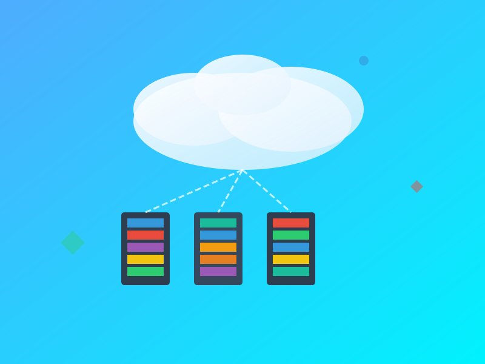

# Taliyo Employee Tracker

A modern employee performance tracking and admin portal built with Next.js, Firebase, and AI-powered insights.

<p align="center">
  
  
  
  
  
</p>

> Internal codename: LeadTrack Pulse (see `docs/blueprint.md`).

## 🚀 Features

- Employee Dashboard
  - Daily task logging (connections, follow-ups, cold emails, leads)
  - Weekly progress summary and charts (responsive Recharts with dark mode)
  - Resource library with ready-to-use scripts and templates
  - Polls & Surveys widget (multi-select, anonymous, expiry-aware)
- Admin Panel
  - Polls & Surveys manager with CSV export and live results
  - Project Board: tasks with assignee, due date, description, attachments, filters
  - Team activity feeds and analytics
  - Resource management and broadcast tools
- Dark Mode (Profile-synced)
  - Theme preference persists to user profile for cross-device consistency
  - Pre-hydration theme init prevents white/black flash
- Support & Privacy (Settings)
  - Contact Admin/HR, Knowledge Base link, Report Issue
  - Manage sessions (logout current / all devices), Download my data, Request Account Deletion
- UX / UI
  - Shadcn/ui component system, semantic tokens, responsive layouts, keyboard-friendly
  - Email masking for non-admin users in sensitive lists (privacy-first)

### ✅ Full feature list

### Employee Dashboard

#### 1. Daily Logs & Attendance
- **Time Tracking**: Clock in/out with geolocation validation
- **Daily Logs**: Submit work reports with task details and time spent
- **Leave Management**: View and apply for leaves with calendar integration
- **Attendance Calendar**: Visual calendar showing attendance status (Present/Absent/Leave)

#### 2. Task & Project Management
- **My Tasks**: View assigned tasks with priorities and deadlines
- **Task Updates**: Mark tasks as in-progress/completed
- **Time Logs**: Log hours against specific tasks/projects
- **Project Overview**: Track progress of assigned projects

#### 3. Team Collaboration
- **Team Directory**: Search and connect with team members
- **Announcements**: Company-wide and department-specific updates
- **Birthdays & Work Anniversaries**: Never miss important dates
- **Organization Chart**: Visual hierarchy of reporting structure

#### 4. Performance & Growth
- **KPI Dashboard**: Track personal performance metrics
- **Goals & OKRs**: Set and monitor quarterly objectives
- **Skill Matrix**: View and update skill proficiency levels
- **Training & Development**: Access learning resources and courses

#### 5. Document Hub
- **Personal Documents**: Upload and manage certificates, IDs, and credentials
- **Company Policies**: Access HR policies and employee handbook
- **Templates**: Download commonly used document templates
- **eSignatures**: Sign documents digitally

#### 6. Communication
- **Announcements**: Company news and updates
- **Polls & Surveys**: Participate in company polls
- **Feedback System**: Submit suggestions and feedback
- **Chat Support**: Quick access to HR/IT support

#### 7. Profile & Settings
- **Personal Information**: Update contact details and emergency contacts
- **Password Management**: Change password and security settings
- **Notification Preferences**: Customize email and in-app notifications
- **Theme & Display**: Light/dark mode and layout preferences

#### 8. Quick Actions
- **Request Leave**: Single-click leave application
- **Download Payslips**: Access salary slips and tax documents
- **Raise Ticket**: Log IT/HR/Admin support tickets
- **Book Resources**: Reserve meeting rooms or equipment

---

### Admin & System Features

- **Authentication**: Secure login with email/password, password reset, and role-based access control.
- **Admin: User Management**
  - Create/Edit employees, role switch (employee/admin), set password, delete user (with optional Storage cleanup)
  - Status management: Active, Training, Inactive; employee code and metadata
- Team Directory
  - Live list of employees with status filters and crisp, initials-only avatars
- Daily Logs + KPIs
  - Per-employee daily log capture; latest metrics surfaced on Profile
- Projects & Tasks
  - Create tasks with schema validation; employees can only toggle completion
  - Task attachments stored in Storage at `projects/{projectId}/tasks/{taskId}/attachments/{fileId}`
- Polls & Surveys
  - Admin creates polls (single/multi, optional anonymous, expiry-aware)
  - Responses stored per poll; voters-tracking for anon scenarios; results summary
- Leaves
  - Employee can request leaves; admins approve/reject with audit fields
- Resources & Announcements
  - Rich, searchable resource library; announcements (latest + history)
- AI Assistants
  - Employee AI Resource Chat with local + Firestore sync
  - Admin Conversational Agent with sessions, message history, and file attachments at `aiChats/{adminId}/sessions/{sessionId}/attachments/{file}`
- Notifications (per user)
  - Read/create/update in `notifications/{uid}/items/{nid}`
- Document Hub
  - Document metadata with versions; files in Storage at `documents/{docId}/{fileId}`
- Visitor Analytics
  - Visitor logs with device details; shown in settings/admin analytics
- Privacy & Security
  - Firestore and Storage rules tuned for least privilege
  - Strict email masking for non-admins (`kr***@*******.**`), initials-only avatars
  - Super admin bootstrap via `NEXT_PUBLIC_SUPER_ADMIN_EMAIL`
- Design System & DX
  - Tailwind semantic tokens, shadcn/ui, dark mode tuned, accessible interactions
  - Strong linting, type-checking, clear project structure

## 🧭 End-to-End User Journeys

- Employee onboarding (first login)
  1. Authenticates via Email/Password (Firebase Auth).
  2. Minimal user doc is auto-bootstrapped if missing (`users/{uid}`) with role and metadata.
  3. Lands on Dashboard with KPIs, resources, polls, and announcements.

- Employee daily workflow
  1. Logs daily metrics (connections, follow-ups, emails, leads) from Dashboard/Profile.
  2. Checks assigned tasks and toggles completion (employees can only update `isCompleted`).
  3. Uses AI Resource Assistant for scripts, templates, and quick help.

- Admin onboarding
  1. Marked via `NEXT_PUBLIC_SUPER_ADMIN_EMAIL` on first login.
  2. Accesses Admin Panel to add/manage employees and roles.
  3. Configures polls, resources, and project board.

- Admin daily operations
  1. Reviews team activity, KPIs, and visitor analytics.
  2. Creates tasks with attachments, manages leaves, posts announcements.
  3. Uses Admin Conversational Agent (with sessions + file attachments) for productivity.

- Privacy & account lifecycle
  1. Users can export their data and request account deletion from Settings.
  2. Admins can revoke sessions, set passwords, or delete users (with optional Storage cleanup).

## 🖼️ Screens & Visuals

<p align="center">
  
</p>

<p align="center">
  
  
  
</p>

<p align="center">
  <em>Modern, fast, and secure — built on Next.js, Firebase, and thoughtful UX.</em>
</p>

## 🧰 Tech Stack

- Frontend: Next.js 15 (App Router) + React 18 + TypeScript
- Styling: Tailwind CSS + Shadcn/ui components
- Backend: Firebase (Auth, Firestore, Storage)
- AI: Genkit + Google AI Studio (Gemini)

## 📦 Prerequisites

- Node.js 18+ (recommend LTS)
- npm or pnpm
- Firebase project (to use Auth/Firestore/Storage)
- Google AI Studio API key (Gemini) if you want AI features

## ⚙️ Setup (Local Development)

1) Clone the repository
```bash
git clone https://github.com/Viraj0001166/Taliyo-Employe-Tracker.git
cd Taliyo-Employe-Tracker
```

2) Install dependencies
```bash
# with npm
npm install
# or with pnpm
pnpm install
```

3) Environment variables
- Copy `.env.example` to `.env` and fill in real values.
- Variables prefixed with `NEXT_PUBLIC_` are safe for the browser.

`.env.example` contains:
```
# Google AI Studio / Gemini
GEMINI_API_KEY=

# Firebase Web App Config
NEXT_PUBLIC_FIREBASE_API_KEY=
NEXT_PUBLIC_FIREBASE_AUTH_DOMAIN=your-project.firebaseapp.com
NEXT_PUBLIC_FIREBASE_DATABASE_URL=https://your-project-default-rtdb.asia-southeast1.firebasedatabase.app
NEXT_PUBLIC_FIREBASE_PROJECT_ID=your-project
NEXT_PUBLIC_FIREBASE_STORAGE_BUCKET=your-project.appspot.com
NEXT_PUBLIC_FIREBASE_MESSAGING_SENDER_ID=
NEXT_PUBLIC_FIREBASE_APP_ID=

# Admin (public, client-side bootstrap only)
NEXT_PUBLIC_SUPER_ADMIN_EMAIL=
```

4) Run the dev server
```bash
npm run dev
# or
pnpm dev
```
The app starts at http://localhost:9002 (see `package.json` -> `dev`).

### Firebase Configuration

1) Enable the following products in your Firebase project:

- Authentication (Email/Password or your chosen provider)
- Firestore (in Native/Production mode)
- Storage (default bucket)

2) Deploy security rules

```bash
# Firestore rules
firebase deploy --only firestore:rules

# Storage rules
firebase deploy --only storage
```

3) Optional: Use Firebase Emulators for local dev

```bash
firebase emulators:start --only firestore,storage
# Then set (in .env.local)
# FIRESTORE_EMULATOR_HOST=localhost:8080
# FIREBASE_STORAGE_EMULATOR_HOST=localhost:9199
```

## 🔢 NPM Scripts

From `package.json`:
- `dev` — Next.js dev with Turbopack on port 9002
- `build` — Next.js production build
- `start` — Start the production server
- `lint` — Lint the project
- `typecheck` — TypeScript type-check only
- `genkit:dev` — Start Genkit runtime and your AI dev server (`src/ai/dev.ts`)
- `genkit:watch` — Same as above but with watch mode

Examples:
```bash
# app dev server
npm run dev

# AI dev tools (in a second terminal)
npm run genkit:dev
```

## 🗂️ Project Structure

```
├─ public/                     # Static assets (logos, svgs, etc.)
├─ src/
│  ├─ app/                     # Next.js App Router pages
│  │  ├─ admin/                # Admin pages
│  │  ├─ employee/             # Employee pages
│  │  ├─ api/                  # Route handlers (API)
│  │  └─ ...
│  ├─ components/              # UI + feature components
│  │  ├─ admin/                # Admin components
│  │  ├─ common/               # Shared components
│  │  └─ ui/                   # Shadcn/ui wrappers
│  ├─ ai/                      # Genkit flows and dev tools
│  ├─ lib/                     # Firebase and utilities
│  └─ hooks/                   # Custom React hooks
├─ docs/                       # Project docs & blueprint
├─ firebase.json               # Firebase configuration
├─ firestore.rules             # Firestore security rules
├─ storage.rules               # Firebase Storage security rules
└─ .env.example                # Example environment variables
```

## 🔐 Security & Environment

- Never commit `.env` files. `.gitignore` already ignores them.
- Only `NEXT_PUBLIC_*` values are exposed on the client. Keep secrets server-side.
- Review `firestore.rules` before going live.
- Review `storage.rules` and test uploads/downloads in both dev and prod.

### Important env vars (excerpt)

```env
NEXT_PUBLIC_SUPER_ADMIN_EMAIL=admin@yourcompany.com
NEXT_PUBLIC_SUPPORT_EMAIL=hr@yourcompany.com
NEXT_PUBLIC_KB_URL=https://kb.yourcompany.com
```

## 🤖 AI / Genkit

- Code: `src/ai/genkit.ts` and `src/ai/flows/*`
- Requires `GEMINI_API_KEY` in `.env`
- Dev tools: `npm run genkit:dev` (or `genkit:watch`)

## 🚢 Deployment

- Vercel (recommended)
  - Add environment variables in Project Settings
  - Build command: `next build`
  - Output: Next.js default

- Firebase Hosting (optional)
  - Ensure your setup supports Next.js SSR (Cloud Functions/Hosting Integration)
  - Configure via `firebase.json`
  - Deploy rules/hosting as needed (requires Firebase CLI)

## 🎨 Design System & UX

- Tailwind semantic tokens: `bg-background`, `text-foreground`, `muted`, `card`, etc.
- Shadcn/ui primitives for consistent, accessible components.
- Dark mode tokens tuned for high contrast and readability.
- Pre-hydration theme script to avoid theme flash.
- Responsive grids and full-width actions on mobile where appropriate.

## 🛠️ Troubleshooting

- Unknown error in Firebase Console while editing Storage rules
  - Cause: Console glitch/billing/permissions. Solution: deploy locally with CLI.
  - `firebase login && firebase use <PROJECT_ID> && firebase deploy --only storage`

- PNPM frozen lockfile failure in CI (`ERR_PNPM_OUTDATED_LOCKFILE`)
  - Run `pnpm install --no-frozen-lockfile` locally, commit `pnpm-lock.yaml`, and ensure CI uses PNPM consistently.

- Avatar upload doesn’t reflect in header
  - We write to Storage at `users/{uid}/profile/*`, update Auth `photoURL`, and `users/{uid}.avatar`.
  - Header live-subscribes to Auth + Firestore to reflect updates instantly.
  - Verify Storage and Firestore rules are deployed; re-login if needed.

## 🧪 Testing (coming soon)
- Add test setup (Jest/Playwright) if needed.

## 🧭 Roadmap (ideas)
- Advanced analytics & leaderboards
- Role-based permissions (Granular)
- More AI-driven suggestions & automations

## 🙌 Contributing
- Fork the repo
- Create a feature branch: `git checkout -b feature/amazing-thing`
- Commit changes: `git commit -m "feat: add amazing thing"`
- Push and open a PR

## 📄 License
- MIT (add a `LICENSE` file if not already present)

---

Maintained with 💙 by Taliyo Technologies. Have suggestions? Open an issue or start a discussion!
