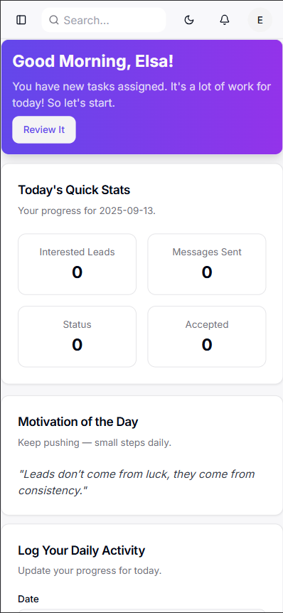

<div align="center">

  # Taliyo Employee Tracker

Modern HR employee portal — daily logs, tasks, polls, resources, and an AI assistant. Built with Next.js, Firebase, and Tailwind CSS.

[](https://github.com/Viraj0001166/Taliyo-Employe-Tracker/actions)
[](#-license)
[](https://github.com/Viraj0001166/Taliyo-Employe-Tracker/stargazers)
[](https://github.com/Viraj0001166/Taliyo-Employe-Tracker/issues)
[](https://github.com/Viraj0001166/Taliyo-Employe-Tracker/pulls)
[](#-contributing)

  </div>

## 📚 Table of Contents
- [💡 About the Project](#-about-the-project)
- [🚀 Features](#-features)
- [🧰 Tech Stack](#-tech-stack)
- [🛠️ Installation](#-installation)
- [▶️ Usage](#-usage)
- [🗂️ Folder Structure](#-folder-structure)
- [🤝 Contributing](#-contributing)
- [📄 License](#-license)
- [📬 Contact](#-contact)

---

## 💡 About the Project

Taliyo Employee Tracker is a unified employee portal that streamlines day-to-day work for teams. Log daily tasks, request leaves, track KPIs, participate in polls, browse internal resources, and get AI-powered help — all in one modern, responsive dashboard.

### ✨ Highlights
- ✅ Daily logs & KPI tracking
- 📝 Assigned tasks with quick stats
- 📊 Company polls & announcements
- 📚 Resources & templates library
- 🤖 AI assistant (resource-aware)
- 🗓️ Leave requests with status tracking
- 👥 Team directory
- 🌙 Polished UI with dark mode

---

## 🧰 Tech Stack

<div align="center">


</div>

---

## 🛠️ Installation

> Prerequisites: Node 18+, pnpm (recommended) or npm, and a Firebase project.

1) Clone the repo
```bash
git clone https://github.com/Viraj0001166/Taliyo-Employe-Tracker.git
cd Taliyo-Employe-Tracker
```

2) Install dependencies
```bash
# with pnpm
pnpm install

# or with npm
npm install
```

3) Environment setup
```bash
# Copy example env file and fill values
cp .env.example .env.local
```

Required keys (example):
```
# Firebase Web App
NEXT_PUBLIC_FIREBASE_API_KEY=...
NEXT_PUBLIC_FIREBASE_AUTH_DOMAIN=...
NEXT_PUBLIC_FIREBASE_PROJECT_ID=...
NEXT_PUBLIC_FIREBASE_STORAGE_BUCKET=...
NEXT_PUBLIC_FIREBASE_MESSAGING_SENDER_ID=...
NEXT_PUBLIC_FIREBASE_APP_ID=...

# Optional: Google AI (Genkit / Gemini)
GEMINI_API_KEY=...
```

4) Start the dev server
```bash
pnpm dev
# Dev server runs by default with Turbopack on port 9002 (see package.json)
# http://localhost:9002
```

---

## ▶️ Usage

### Start development
```bash
pnpm dev
```

### Build and preview
```bash
pnpm build
pnpm start
```

<details>
<summary><b>🖼️ Screenshots / Demos</b></summary>

<div align="center">

<!-- Full Dashboard -->


<!-- AI Assistant Widget -->


<!-- Mobile View (narrow) -->


</div>

<sub>If images don't render, add your screenshots at:
<code>docs/screenshots/dashboard.png</code>,
<code>docs/screenshots/ai-assistant.png</code>,
<code>docs/screenshots/mobile.png</code>.</sub>

</details>

<details>
<summary><b>🧪 Sample API</b></summary>

Suggest improvements from weekly logs:
```bash
curl -X POST http://localhost:3000/api/suggest-improvements \
  -H "Content-Type: application/json" \
  -d '{
    "employeeId":"EMPLOYEE_UID"
  }'
```

Sample response:
```json
{
  "analysis": "Lead generation metrics improved mid-week...",
  "suggestions": "Aim for consistency; set a daily target..."
}
```
</details>

---

## 🗂️ Folder Structure

```bash
Taliyo-Employe-Tracker/
  docs/
    blueprint.md
    employee-guide-hindi.md
  public/
    logo-circle.svg
    logo-mark.svg
    tech-illustrations/
  src/
    ai/
      flows/
      prompts/
      genkit.ts
    app/
      admin/
      api/
        suggest-improvements/route.ts
      dashboard/page.tsx
      employee/guide/
        page.tsx
        layout.tsx
    components/
      dashboard/
        leave-request.tsx
        weekly-summary.tsx
        ai-chatbot.tsx
      ui/
    hooks/
    lib/
       firebase.ts
       types.ts
  .env.example
  next.config.ts
  tailwind.config.ts
  package.json
  pnpm-lock.yaml
```

---

## 🤝 Contributing

[](https://www.contributor-covenant.org/version/2/1/code_of_conduct/)

- Open an issue for bugs, enhancements, and ideas.
- Fork the repo and create feature branches from `main`.
- Keep commits focused; use clear messages.
- Add screenshots or tests when applicable.
- Follow the code of conduct and be kind.

Quick start:
```bash
git checkout -b feat/your-feature
# make changes
git commit -m "feat: add your-feature"
git push origin feat/your-feature
# open a Pull Request on GitHub
```

---

## 📄 License

[](LICENSE)

This project is licensed under the MIT License — see the [LICENSE](LICENSE) file for details.

---

## 📬 Contact

- **Maintainer:** Viraj Srivastav
- **Company:** Taliyo Technologies
- **Website:** https://taliyotechnologies.com
- **LinkedIn:** https://www.linkedin.com/in/viraj-srivastav/
- **Email:** cofounder@taliyotechnologies.com


---

<div align="center">

✨ Built with ❤️ by Taliyo Technologies ✨

</div>
